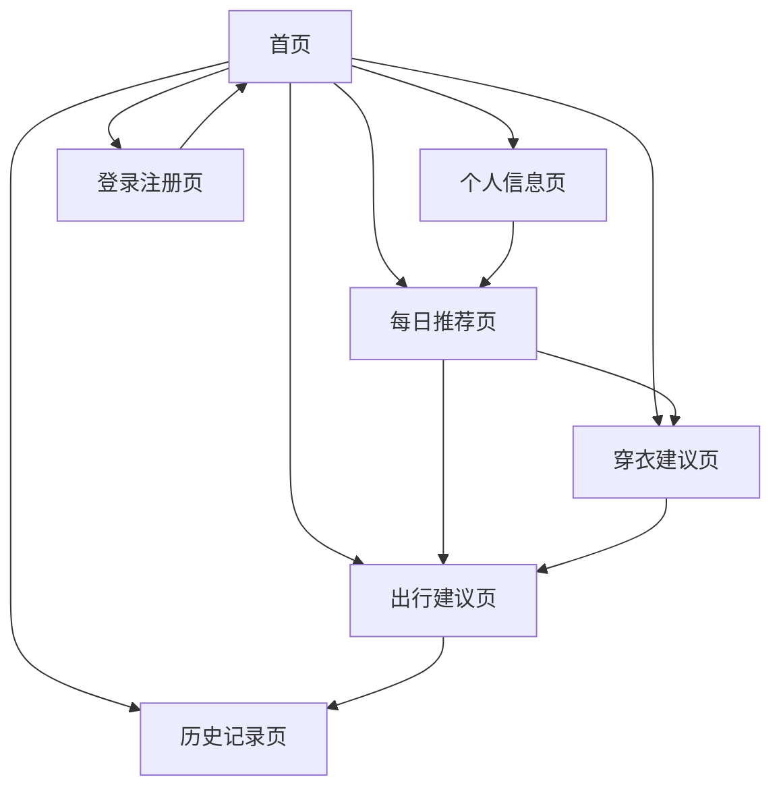

# 五行穿衣建议系统 - 产品需求文档

## 1. 产品概述

五行穿衣建议系统是一款基于传统五行理论的个人穿衣出行指导应用，通过用户的出生信息结合当日五行属性，为用户提供个性化的穿衣颜色和出行建议。

该产品旨在为关注传统文化和个人运势的用户群体提供日常生活指导，帮助用户在穿衣搭配和出行安排上做出更符合五行理论的选择，提升个人运势和生活品质。

## 2. 核心功能

### 2.1 用户角色

| 角色 | 注册方式 | 核心权限 |
|------|----------|----------|
| 普通用户 | 手机号或邮箱注册 | 可查看每日穿衣建议、保存个人信息、查看历史记录 |
| VIP用户 | 付费升级 | 享受高级建议、详细解析、个性化定制服务 |

### 2.2 功能模块

我们的五行穿衣建议系统包含以下主要页面：

1. **首页**：今日运势概览、快速建议展示、功能导航
2. **个人信息页**：出生信息录入、八字信息展示、个人档案管理
3. **每日推荐页**：基于日期五行属性的个性化推荐、AI智能分析
4. **穿衣建议页**：当日穿衣颜色建议、搭配方案、五行解析
5. **出行建议页**：出行方位建议、时间选择、注意事项
6. **历史记录页**：历史建议查看、效果反馈、数据统计
7. **登录注册页**：用户认证、账户管理

### 2.3 页面详情

| 页面名称 | 模块名称 | 功能描述 |
|----------|----------|----------|
| 首页 | 今日概览 | 显示当日五行属性、天气信息、运势简报 |
| 首页 | 快速建议 | 展示核心穿衣颜色建议、一键查看详情 |
| 首页 | 功能导航 | 提供各功能模块入口、用户状态显示 |
| 个人信息页 | 基本信息 | 录入姓名、性别、出生年月日时信息 |
| 个人信息页 | 八字展示 | 显示生辰八字、五行属性分析、命理解读 |
| 个人信息页 | 档案管理 | 编辑个人信息、偏好设置、隐私控制 |
| 每日推荐页 | 日期五行分析 | 显示当日五行属性、与用户五行的匹配度分析 |
| 每日推荐页 | AI智能推荐 | 基于Gemini AI生成个性化建议：穿衣颜色、饮食、行为指导 |
| 每日推荐页 | 综合建议 | 整合穿衣、饮食、行为等全方位生活建议 |
| 穿衣建议页 | 颜色建议 | 推荐当日适宜颜色、避忌颜色、搭配建议 |
| 穿衣建议页 | 搭配方案 | 提供具体搭配示例、材质建议、配饰推荐 |
| 穿衣建议页 | 五行解析 | 详细说明五行理论依据、个人适配分析 |
| 出行建议页 | 方位指导 | 推荐出行方向、避忌方位、路线建议 |
| 出行建议页 | 时间选择 | 建议出行时辰、重要事务安排时间 |
| 出行建议页 | 注意事项 | 当日需要注意的事项、禁忌提醒 |
| 历史记录页 | 记录查看 | 查看历史建议记录、搜索筛选功能 |
| 历史记录页 | 效果反馈 | 用户反馈建议效果、评分系统 |
| 历史记录页 | 数据统计 | 使用频率统计、建议准确度分析 |
| 登录注册页 | 用户认证 | 手机号/邮箱登录注册、密码管理 |
| 登录注册页 | 账户管理 | 个人资料修改、密码重置、账户注销 |

## 3. 核心流程

**普通用户流程：**
用户首次使用需要注册账户并录入出生信息，系统自动计算八字信息。用户每日可查看当天的综合推荐，包括基于日期五行属性和个人五行的AI智能分析，获得穿衣、饮食、行为等全方位建议。用户可以保存喜欢的建议并提供反馈。

**VIP用户流程：**
VIP用户除享受普通功能外，还可获得更详细的五行分析、个性化定制建议、专属客服咨询等高级服务。

**每日推荐核心流程：**
系统每日自动计算当天的五行属性，结合用户个人八字信息，通过Gemini AI生成个性化推荐。推荐内容包括：适宜的穿衣颜色搭配、有利的饮食选择、推荐的行为活动、需要注意的事项等。

## 4. 用户界面设计

### 4.1 设计风格

- **主色调**：以传统五行颜色为基础，主色为深蓝色(#1E3A8A)，辅助色为金色(#F59E0B)
- **按钮样式**：圆角矩形按钮，具有轻微阴影效果，支持渐变色彩
- **字体**：中文使用思源黑体，英文使用Roboto，主要字号16px，标题字号20px
- **布局风格**：卡片式布局，顶部导航栏，底部标签栏，支持左右滑动切换
- **图标风格**：使用传统文化元素图标，如太极、八卦、五行符号等

### 4.2 页面设计概览

| 页面名称 | 模块名称 | UI元素 |
|----------|----------|--------|
| 首页 | 今日概览 | 渐变背景卡片，五行色彩指示器，天气图标，运势评分圆环 |
| 首页 | 快速建议 | 颜色色块展示，简洁文字说明，查看详情按钮 |
| 个人信息页 | 基本信息 | 表单输入框，日期选择器，性别单选按钮 |
| 个人信息页 | 八字展示 | 传统八字排盘样式，五行属性雷达图，文字解读区域 |
| 每日推荐页 | 日期五行分析 | 日历样式显示，五行属性标识，匹配度进度条 |
| 每日推荐页 | AI智能推荐 | 卡片式布局，分类标签（穿衣/饮食/行为），AI生成内容展示 |
| 每日推荐页 | 综合建议 | 时间轴样式，优先级排序，一键应用功能 |
| 穿衣建议页 | 颜色建议 | 大色块展示推荐颜色，小色块展示避忌颜色，渐变分割线 |
| 穿衣建议页 | 搭配方案 | 服装图片展示，标签式材质说明，滑动查看更多 |
| 出行建议页 | 方位指导 | 罗盘样式方位图，方向箭头指示，文字说明 |
| 历史记录页 | 记录查看 | 时间轴样式列表，搜索框，筛选标签 |

### 4.3 响应式设计

产品采用移动端优先设计，主要面向手机用户，同时兼容平板设备。界面支持触摸操作优化，包括滑动切换、长按操作等手势交互。