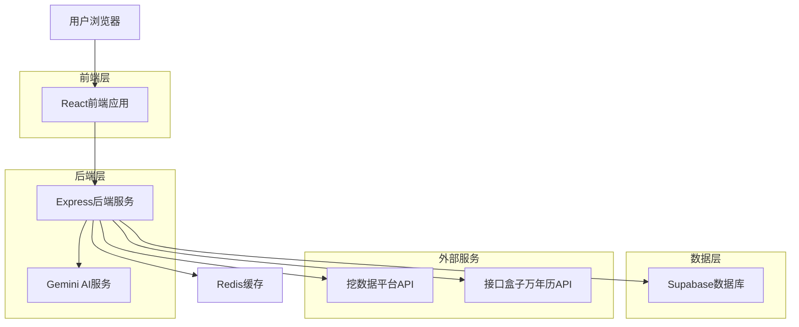
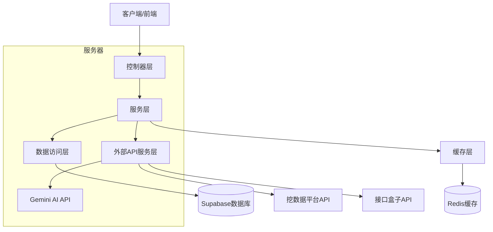
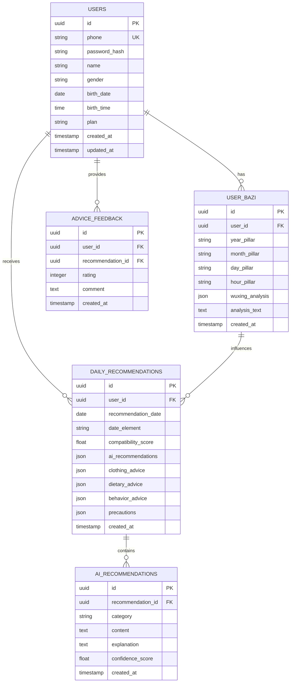

# 五行穿衣建议系统 - 技术架构文档

## 1. 架构设计



## 2. 技术描述

* 前端：React\@18 + TypeScript + Tailwind CSS + Vite

* 后端：Express\@4 + TypeScript + Node.js

* 数据库：Supabase (PostgreSQL)

* 缓存：Redis

* 外部API：挖数据平台八字API、接口盒子万年历API、Google Gemini AI API
* AI服务：@google/generative-ai SDK

## 3. 路由定义

| 路由        | 用途                  |
| --------- | ------------------- |
| /         | 首页，显示今日运势概览和快速建议    |
| /login    | 登录页面，用户身份验证         |
| /register | 注册页面，新用户注册          |
| /profile  | 个人信息页，管理出生信息和八字数据   |
| /clothing | 穿衣建议页，显示当日穿衣颜色和搭配建议 |
| /travel   | 出行建议页，提供出行方位和时间建议   |
| /daily    | 每日推荐页，显示基于日期五行属性的AI智能推荐 |
| /history  | 历史记录页，查看过往建议和反馈     |

## 4. API定义

### 4.1 核心API

**用户认证相关**

```
POST /api/auth/register
```

请求参数：

| 参数名      | 参数类型   | 是否必填 | 说明   |
| -------- | ------ | ---- | ---- |
| phone    | string | 是    | 手机号码 |
| password | string | 是    | 密码   |
| name     | string | 是    | 用户姓名 |

响应参数：

| 参数名     | 参数类型    | 说明      |
| ------- | ------- | ------- |
| success | boolean | 注册是否成功  |
| token   | string  | JWT认证令牌 |
| user    | object  | 用户基本信息  |

**八字信息获取**

```
POST /api/bazi/calculate
```

请求参数：

| 参数名       | 参数类型   | 是否必填 | 说明              |
| --------- | ------ | ---- | --------------- |
| birthDate | string | 是    | 出生日期 YYYY-MM-DD |
| birthTime | string | 是    | 出生时间 HH:mm      |
| gender    | string | 是    | 性别 male/female  |

响应参数：

| 参数名      | 参数类型   | 说明     |
| -------- | ------ | ------ |
| bazi     | object | 八字信息   |
| wuxing   | object | 五行属性分析 |
| analysis | string | 命理解读   |

**每日推荐获取**

```
GET /api/daily/recommendations
```

请求参数：

| 参数名  | 参数类型   | 是否必填 | 说明        |
| ---- | ------ | ---- | --------- |
| date | string | 否    | 查询日期，默认今日 |

响应参数：

| 参数名             | 参数类型   | 说明     |
| --------------- | ------ | ------ |
| dateElement     | string | 当日五行属性 |
| compatibility   | number | 与用户五行匹配度 |
| aiRecommendations | object | AI生成的个性化推荐 |
| clothingAdvice  | object | 穿衣建议详情 |
| dietaryAdvice   | object | 饮食建议详情 |
| behaviorAdvice  | object | 行为建议详情 |
| precautions     | array  | 注意事项列表 |

**AI推荐生成**

```
POST /api/ai/generate-recommendations
```

请求参数：

| 参数名         | 参数类型   | 是否必填 | 说明        |
| ----------- | ------ | ---- | --------- |
| userElement | object | 是    | 用户五行属性  |
| dateElement | string | 是    | 当日五行属性  |
| date        | string | 是    | 目标日期    |

响应参数：

| 参数名           | 参数类型   | 说明       |
| ------------- | ------ | -------- |
| clothing      | object | 穿衣建议     |
| dietary       | object | 饮食建议     |
| behavior      | object | 行为建议     |
| precautions   | array  | 注意事项     |
| explanation   | string | AI分析说明   |

示例请求：

```json
{
  "birthDate": "1990-05-15",
  "birthTime": "08:30",
  "gender": "male"
}
```

示例响应：

```json
{
  "success": true,
  "data": {
    "clothingColors": ["红色", "橙色", "黄色"],
    "avoidColors": ["黑色", "蓝色"],
    "travelDirection": "东南方",
    "luckyTime": ["09:00-11:00", "15:00-17:00"],
    "suggestions": "今日火旺，宜穿暖色系服装，利于事业发展"
  }
}
```

## 5. 服务器架构图



## 6. 数据模型

### 6.1 数据模型定义



### 6.2 数据定义语言

**用户表 (users)**

```sql
-- 创建用户表
CREATE TABLE users (
    id UUID PRIMARY KEY DEFAULT gen_random_uuid(),
    phone VARCHAR(20) UNIQUE NOT NULL,
    password_hash VARCHAR(255) NOT NULL,
    name VARCHAR(50) NOT NULL,
    gender VARCHAR(10) CHECK (gender IN ('male', 'female')),
    birth_date DATE NOT NULL,
    birth_time TIME NOT NULL,
    plan VARCHAR(20) DEFAULT 'free' CHECK (plan IN ('free', 'vip')),
    created_at TIMESTAMP WITH TIME ZONE DEFAULT NOW(),
    updated_at TIMESTAMP WITH TIME ZONE DEFAULT NOW()
);

-- 创建索引
CREATE INDEX idx_users_phone ON users(phone);
CREATE INDEX idx_users_created_at ON users(created_at DESC);

-- 权限设置
GRANT SELECT ON users TO anon;
GRANT ALL PRIVILEGES ON users TO authenticated;
```

**用户八字表 (user\_bazi)**

```sql
-- 创建八字表
CREATE TABLE user_bazi (
    id UUID PRIMARY KEY DEFAULT gen_random_uuid(),
    user_id UUID REFERENCES users(id) ON DELETE CASCADE,
    year_pillar VARCHAR(10) NOT NULL,
    month_pillar VARCHAR(10) NOT NULL,
    day_pillar VARCHAR(10) NOT NULL,
    hour_pillar VARCHAR(10) NOT NULL,
    wuxing_analysis JSONB,
    analysis_text TEXT,
    created_at TIMESTAMP WITH TIME ZONE DEFAULT NOW()
);

-- 创建索引
CREATE INDEX idx_user_bazi_user_id ON user_bazi(user_id);

-- 权限设置
GRANT SELECT ON user_bazi TO anon;
GRANT ALL PRIVILEGES ON user_bazi TO authenticated;
```

**每日推荐表 (daily\_recommendations)**

```sql
-- 创建每日推荐表
CREATE TABLE daily_recommendations (
    id UUID PRIMARY KEY DEFAULT gen_random_uuid(),
    user_id UUID REFERENCES users(id) ON DELETE CASCADE,
    recommendation_date DATE NOT NULL,
    date_element VARCHAR(10) NOT NULL,
    compatibility_score FLOAT CHECK (compatibility_score >= 0 AND compatibility_score <= 1),
    ai_recommendations JSONB,
    clothing_advice JSONB,
    dietary_advice JSONB,
    behavior_advice JSONB,
    precautions JSONB,
    created_at TIMESTAMP WITH TIME ZONE DEFAULT NOW()
);

-- 创建索引
CREATE INDEX idx_daily_recommendations_user_id ON daily_recommendations(user_id);
CREATE INDEX idx_daily_recommendations_date ON daily_recommendations(recommendation_date DESC);
CREATE UNIQUE INDEX idx_daily_recommendations_user_date ON daily_recommendations(user_id, recommendation_date);

-- 权限设置
GRANT SELECT ON daily_recommendations TO anon;
GRANT ALL PRIVILEGES ON daily_recommendations TO authenticated;
```

**AI推荐详情表 (ai\_recommendations)**

```sql
-- 创建AI推荐详情表
CREATE TABLE ai_recommendations (
    id UUID PRIMARY KEY DEFAULT gen_random_uuid(),
    recommendation_id UUID REFERENCES daily_recommendations(id) ON DELETE CASCADE,
    category VARCHAR(20) NOT NULL CHECK (category IN ('clothing', 'dietary', 'behavior', 'precaution')),
    content TEXT NOT NULL,
    explanation TEXT,
    confidence_score FLOAT CHECK (confidence_score >= 0 AND confidence_score <= 1),
    created_at TIMESTAMP WITH TIME ZONE DEFAULT NOW()
);

-- 创建索引
CREATE INDEX idx_ai_recommendations_recommendation_id ON ai_recommendations(recommendation_id);
CREATE INDEX idx_ai_recommendations_category ON ai_recommendations(category);

-- 权限设置
GRANT SELECT ON ai_recommendations TO anon;
GRANT ALL PRIVILEGES ON ai_recommendations TO authenticated;
```

**建议反馈表 (advice\_feedback)**

```sql
-- 创建反馈表
CREATE TABLE advice_feedback (
    id UUID PRIMARY KEY DEFAULT gen_random_uuid(),
    user_id UUID REFERENCES users(id) ON DELETE CASCADE,
    recommendation_id UUID REFERENCES daily_recommendations(id) ON DELETE CASCADE,
    rating INTEGER CHECK (rating >= 1 AND rating <= 5),
    comment TEXT,
    created_at TIMESTAMP WITH TIME ZONE DEFAULT NOW()
);

-- 创建索引
CREATE INDEX idx_advice_feedback_user_id ON advice_feedback(user_id);
CREATE INDEX idx_advice_feedback_advice_id ON advice_feedback(advice_id);
CREATE INDEX idx_advice_feedback_rating ON advice_feedback(rating DESC);

-- 权限设置
GRANT SELECT ON advice_feedback TO anon;
GRANT ALL PRIVILEGES ON advice_feedback TO authenticated;
```

**初始化数据**

```sql
-- 插入测试用户数据
INSERT INTO users (phone, password_hash, name, gender, birth_date, birth_time, plan)
VALUES 
('13800138000', '$2b$10$example_hash', '张三', 'male', '1990-05-15', '08:30:00', 'free'),
('13900139000', '$2b$10$example_hash', '李四', 'female', '1985-10-20', '14:20:00', 'vip');
```

